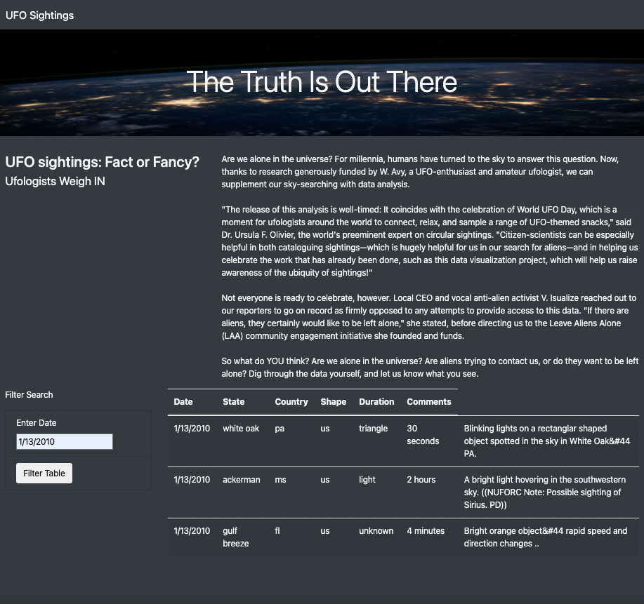
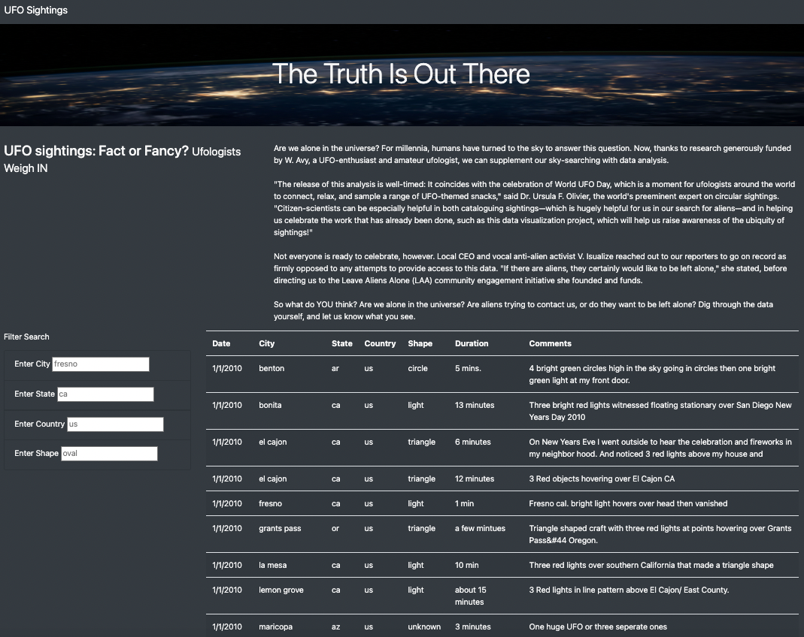
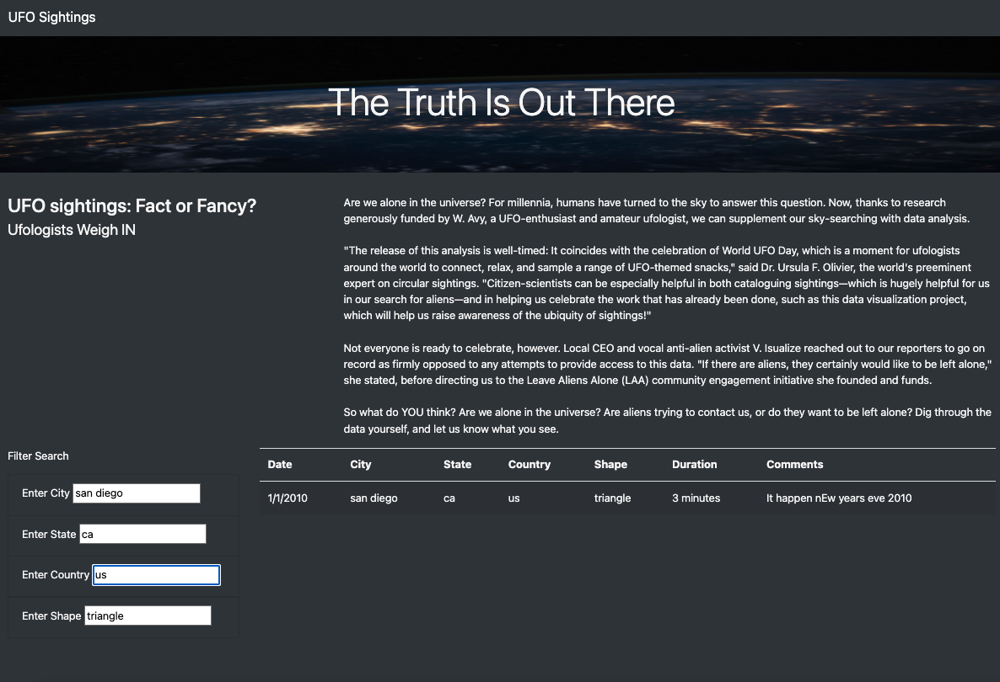

# Ufos - Project Overview

Dana is a journalist and UFO enthusiast from McMinnville, Oregon.  She has always been interested in UFOs, and now that she's back in her hometown she wants to write an article about this topic. Dana also decided on venturing into building a website so that other UFO enthusiasts, such as herself, could search through some data regarding UFO sightings.

## Analysis
The purpose of this website is to allow UFO enthusiasts to explore UFO sighting data, so that they know specific details about documented sightings, such as date, city, shape, etc. 
To build this website, Dana utilized data that was presented in a JavaScript object and used JavaScript  to create different filters. 


### Initial Results
The first version of Dana’s website contained only one filter that allowed users to filter by date. The following is a code sample that was used to create that filter. 

```

function handleClick() {
    // grab the datetime value from the filter
    let date = d3.select("#datetime").property("value");
    let filteredData = tableData;
    // check to see if a date was entered and filter the data using the date
    if (date) {
        // apply filter to table data to keep rows where datetime value matches the filter value
        filteredData = filteredData.filter(row  => row.datetime === date);
    };
        // rebuild the table using the filtered data
        // NOTE if no date was entered, then filteredData will just be the original tableData
        buildTable(filteredData);
}
```

- Here’s an image of the first website.



Although Dana was able to build a dynamic page, she wanted to give users the ability to do a more detailed analysis of the data. She decided to create four filters instead of one so that the data could be explored using different criteria simultaneously. She added filters for city, state, country, and UFO shape.

Using the following code, the webpage looped through the filters returning what the user was searching for. 

```
function filterTable() {
  
    // 8. Set the filtered data to the tableData.
    let filteredData = tableData;
  
    // 9. Loop through all of the filters and keep any data that
    // matches the filter values
    Object.entries(filters).forEach(([key, value]) => {
      if (key === "city"){
        filteredData = filteredData.filter(row=>row.city === value);
      }
      if (key === "state"){
        filteredData = filteredData.filter(row=>row.state === value); 
      }
      if (key === "country"){
        filteredData = filteredData.filter(row=>row.country === value); 
      }
      if (key === "shape"){
        filteredData = filteredData.filter(row=>row.shape === value); 
      }
  
    })
    // 10. Finally, rebuild the table using the filtered data
    buildTable(filteredData);
  }
  
```
This is the final website containing the four filters.



This website provides the ability to search by country, state, city, and shape of UFO. To perform a search, the user enters a text in any of the search boxes and hits enter or sets the cursor in any other search box to refine the search, the table is then updated with only the records that match any or all the search criteria.

Here’s a screenshot of a search done by a user looking for a specific UFO sighting that had an unusual triangle shape that happened in San Diego, CA. 




## Summary

One drawback of the current website is that the date search box was removed; yet, if we wanted to add it again, we could refine it. Previously the date search box allowed the user to enter any text; however, we could improve the date filter by allowing the user to select a date with a calendar. Using a calendar would let the user select a date and enter it in the correct format. 

Other recommendations for further development are alerts and buttons. For instance, we could alert the user that some filters were applied to the table and display the number of records matching the criteria. Another drawback of the current website is that it can only display the entire data back by removing each text entry in the input boxes to clear the filters, so we could also add a button to clear filters to make it easier for the user. 

Dana’s website was an interesting project and UFO enthusiasts will certainly have a good time exploring this data.  

Here's the link to Dana's UFO website: [The Truth is Out There](https://katiarp.github.io/Ufos/).


